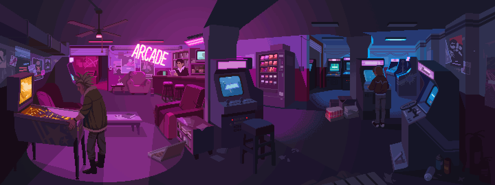

    <h1>Hi there, I'm Yana 🖐🏻</h1>
    <h3>Aspiring Product manager 📱</h3>

    
    <a href="https://www.behance.net/leontly">
        
    
        
        </a>

<h2> Whoami 🐕</h2>

<h4>My goal is to enhance my expertise in the field of product development, leveraging core programming principles. At the moment, I am practicing in UX research and studying the principles of creating user-friendly interfaces to create innovative and successful products.  I participated in a startup accelerator at the Innopolis University. Here, I acquired valuable experience in a dynamic and innovative environment, learning to effectively lead teams, shape product strategies, and execute project planning and control. In School 21, I am studying fundamental programming principles and developing skills in modern technologies and tools, including web application development, database management, and mobile applications.</h4>

    <h2>My developer tools 👩🏼‍💻</h2>
    
    
    
        <h4>CSS, Python, Docker, Kubernetes, Git, Github, Bitbucket, Nginx, CI/CD GitLab, PosgreSQL, C/C++, Linux/IOS.</h4>

    <h2>Reach me on 📫</h2>
     
     
     

<h2>My project 📚</h2>

|**21-School project**| **Status**|**Description**| **Stack**|
| ------ | ------ | ------ | ------ |
| `C01` [SimpleBashUtils](https://github.com/kefirpixel/Cat_and_Grep_from_Linux)|328 XP, 131% |This project contains two basic Bash text manipulation utilities for linux.|C/Bash/Docker/Linux
| `C06` [s21_matrix](https://github.com/kefirpixel/matrix_library)|200 XP, 100%|Realization of own library for numerical matrix processing.|C|
| `C07` [SmartCalc v1.0](https://github.com/kefirpixel/SmartCalc_v1.0)|650 XP, 130%|An extended version of the regular calculator found in the standard applications of every operating system.|C/C++/Qt6/Docker
| `C08` [3D Viewer v1.0]()|In progress|A program for viewing 3D wireframe models.|C/C++/Qt6/OpenGL|
| `D01-D06` [DevOps branch](https://github.com/kefirpixel/basic_DevOps)|1702 XP, 100%|Basic projects for working with universal developer tools.|Docker/Linux/nginx/GitLab CI-CD/Bash/C

<h2>Check out my other repos ⬇️</h2>

